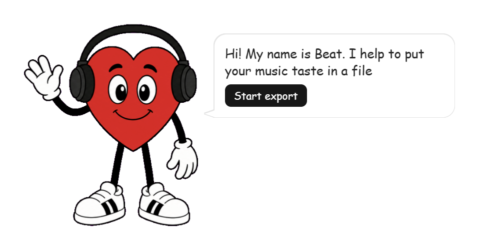

# ❤️ Likes to Go

Hi — I'm Beat, a little heart who helps you export your SoundCloud likes as a file. No accounts, no servers, no audio downloaded. Your data, to go.

## 🎵 What it does

You have hundreds (or thousands) of liked tracks on SoundCloud. I'll save them as a file you can keep — a personal backup of your music library.

- Open your SoundCloud likes page
- Click the Likes to Go ❤️ icon in your browser toolbar to call me up, then hit **Start export**
- Get a file with every track: title, artist, URL, artwork, and more

That's it. Your likes, your file, your hard drive.

## 📥 Install

### 🏪 Chrome Web Store — recommended

[Install Likes to Go from the Chrome Web Store](https://chromewebstore.google.com/detail/likes-to-go/bleniiemffekgejceicenjdomcapbhmg)

One click, and you get updates automatically. This is the way I'd pick.

### 🛠️ Dev mode (sideload) — fallback

Only if the Chrome Web Store doesn't work for you — blocked in your region, restricted by policy, or you want a specific release:

1. Download the latest `.zip` from [Releases](https://github.com/ZUGAZ/likes-to-go/releases).
2. Unzip it.
3. Open `chrome://extensions/` and enable **Developer mode**.
4. Click **Load unpacked** and select the unzipped folder.

Dev mode doesn't auto-update — repeat these steps for each new release.

## 🚀 Usage

1. Open your SoundCloud likes page (Badges or List view).
2. Click the Likes to Go toolbar icon.
   - On a **SoundCloud** tab, I appear **in-page**.
   - On **other** tabs, the icon opens the **popup** — same me, same buttons.
3. Click **Start export**.
4. When I'm done, click **Download backup** to save your file.

## 📚 Learn more

- [Supported SoundCloud views](docs/supported-soundcloud-views.md)
- [What's in the export file](docs/export-format.md)

## 🔒 Privacy

- Your data stays in your browser session — I never send it anywhere.
- No accounts, no sign-up, and no external backend.
- No analytics or telemetry.
- Only track metadata goes into your backup; audio is never downloaded.

Read the full [Privacy Policy](PRIVACY.md).

## 💬 Support

Need a hand or found a snag while exporting? [Open a GitHub issue](https://github.com/ZUGAZ/likes-to-go/issues/new) — I'll be glad you did.

## 📜 License

Released under [MIT](LICENSE).

## 🤝 Contributing

See [CONTRIBUTING.md](CONTRIBUTING.md) for architecture, coding standards, and development workflow.

Disclaimer: This extension is for personal data backup. You are responsible for your own compliance with SoundCloud's Terms of Use.
